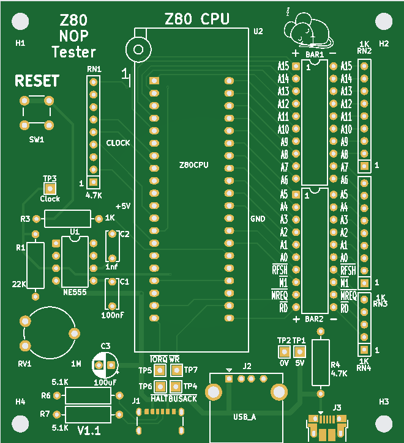
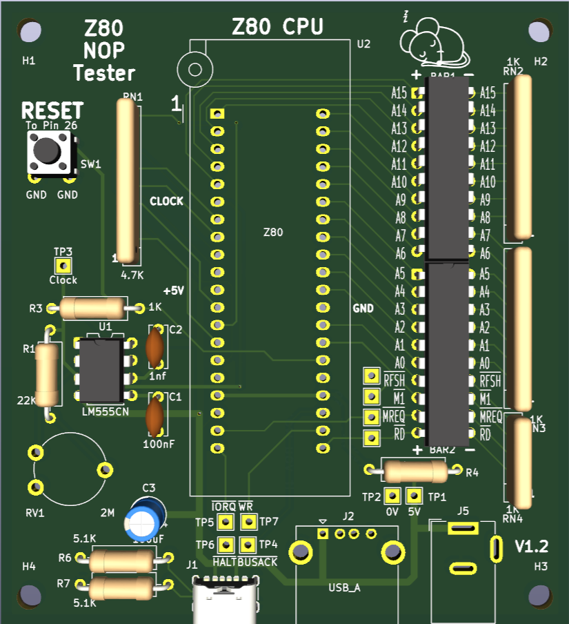

# Z80 NOP Tester v1.2 

Z80 CPU NOP Instruction Tester

## Introduction

This board has been designed to allow a Z80 to run NOP instructions slowly enough to see address and various control lines to aid in diagnostics

In Z80 assembly, NOP (No Operation) is the opcode 0x00.

When executed, the CPU does nothing for one machine cycle and then increments the program counter (PC) to fetch the next instruction.

## What it Tests
* Clock circuit (CPU is being driven)
* Reset circuit (PC starts at 0x0000)
* Address bus (sequential counting)
* Basic instruction fetch and decode mechanism

## What You Can See
* A display of the address bus contents as it increments
* Status of RFSH, M1, MREQ and RD signals

## What You Can Measure
* Test points for clock, 0V and 5V
* Test points for s RFSH, M1, MREQ, RD IORQ, WR, HALT, BUSACK (Useful if your Z80 is mis-behaving)

# Z80 NOP Tester v2.1

Z80 CPU NOP HALT Instruction Tester

## Introduction

An extended version of the board which allows the use of HALT instructions to test dynamic memory refresh operations

In Z80 assembly, HALT is the opcode 0x76.

When executed, the CPU enters HALT mode and ceases executing except for memory refresh operations

For full documentation, see the [NOP pdf here](Z80_NOP.pdf) and [NOP HALT pdf here](Z80_NOP_HALT.pdf)

